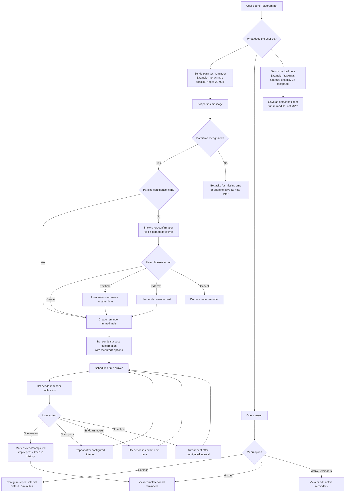

# Deep Interview Spec: TG Reminder Bot

Metadata:
- Profile: standard
- Context type: greenfield
- Final ambiguity: 17%
- Threshold: 20%
- Context snapshot: `.omx/context/tg-reminder-bot-20260623T212057Z.md`
- Interview transcript: `.omx/interviews/tg-reminder-bot-20260623T215107Z.md`

## Intent

The user wants to replace a slow Telegram scheduled-message workflow with a fast personal reminder bot. The current process is too manual: open saved messages, write text, hold send, choose the scheduled time, and later deal with clutter. The deeper problem is not just note-taking; it is reliable personal prompting with minimal creation friction and automatic recovery when the user misses or ignores a reminder.

## Desired Outcome

The first version should let the user create one-off reminders quickly by sending plain text to a Telegram bot. The bot should parse the reminder text and date/time from the user's message, create the reminder when confident, confirm success, and later notify the user with buttons for completing or repeating the reminder.

The intended feeling is: "I opened the bot, wrote one phrase, and the reminder is safely handled."

## MVP Scope

The MVP includes speed-first text-based reminder creation from ordinary bot messages, without requiring the user to start from a menu. If the user writes a phrase that contains a recognizable date or time, the bot should parse it as a reminder creation request.

Examples:

- "погулять с собакой через 20 мин"
- "забрать справку 26 февраля 2027 года"

The MVP includes reminder notifications with these buttons:

- "Прочитано": mark the reminder as handled/completed/read and stop active repeats.
- "Повторить": repeat after the user's configured short-repeat interval.
- "Выбрать время": select a specific next reminder time.

The MVP includes a default short-repeat interval setting. The default should be 5 minutes, and the user should be able to configure it in minutes or hours.

The MVP includes automatic repeat behavior: if the reminder fires and the user does not press any button, the bot should repeat the notification after the configured interval.

The MVP should keep completed/read reminders in history rather than immediately deleting them.

## Out Of Scope For MVP

Voice reminder creation is not part of the first implementation, even though it is a major desired future feature.

A full idea inbox or notes-without-time system is not part of the first implementation.

Recurring reminders such as "каждый день в 9" or "каждую пятницу" are not part of the first implementation.

Complex productivity analytics, statistics, and advanced history workflows are not part of the first implementation.

## Future Modules To Preserve

Voice creation should be a future first-class path. The long-term target is: open bot, tap microphone, say one phrase, and have the reminder created.

Idea inbox should be preserved as a later module. It should allow saving messages without a reminder time, especially when a user explicitly says "заметка:" or "сохрани:".

Recurring reminders should be preserved as a later module.

History should support future actions such as restore, delete, repeat, or create a new reminder from an old one.

Advertising posts may become a future monetization module if the bot is opened to public users. This should remain separate from the core reminder lifecycle.

## Business Direction

The bot is private-first. It should initially solve the user's own reminder workflow, and only later may become public.

The first version should be free and should not include subscriptions, paid limits, or payment flows.

If monetization is considered later, the preferred direction is advertising posts inside the bot rather than paid user features.

Reminder text, history, and future voice content are moderately sensitive but not critical for the initial personal use case. If the bot becomes public, each user must only be able to access their own reminders and settings.

## Selected Implementation Stack

The selected MVP stack is Python 3.12+, aiogram 3.x, PostgreSQL, SQLAlchemy 2.x async ORM, asyncpg, Alembic, pydantic-settings, dateparser, pytest, pytest-asyncio, Ruff, uv, and Docker Compose.

The MVP should use long polling for Telegram updates and a custom DB-backed polling worker for due reminders. Redis, Celery, APScheduler, FastAPI, MongoDB, payments, webhooks, voice input, recurring reminders, and a full inbox are deferred unless `AGENTS.md` and the ExecPlan are updated.

The current implementation ExecPlan is `.agent/execplans/tg-reminder-bot-mvp.md`.

The current shared database diagram is `docs/database-schema.md`.

The current temporary-confirmation table name is `drafts`.

## Parsing Rules

If a message contains a recognizable date or time, the bot should treat it as a reminder by default.

If the user wants to store text that contains a date without creating a reminder, they should use an explicit marker such as "заметка:" or "сохрани:".

When parsing is confident, the bot should create the reminder immediately and send a success confirmation.

When parsing is uncertain, the bot should show a compact confirmation instead of silently creating a potentially wrong reminder.

Example uncertain confirmation:

    Создать напоминание?
    Текст: забрать справку
    Когда: 26 февраля 2027, 09:00?
    [Создать] [Изменить время] [Изменить текст] [Отмена]

## Decision Boundaries

Future implementation may choose internal storage, framework, data model, parser implementation, and exact Telegram button layout as long as the MVP behaviors above are preserved.

Future implementation should ask before changing the product scope to include voice, recurring reminders, or a full inbox in the first version.

Future implementation should preserve the speed-first UX principle: avoid menu-first creation and extra confirmations when the bot is confident.

Future implementation may omit payment/subscription infrastructure from the MVP.

## Acceptance Criteria

A user can send "погулять с собакой через 20 мин" and receive a confirmation that a reminder was created for 20 minutes later.

A user can send "забрать справку 26 февраля 2027 года" and the bot creates a reminder with text "забрать справку" for February 26, 2027.

The normal text flow starts from a plain message in the bot chat, not from a required menu command.

When a reminder fires, the user sees buttons "Прочитано", "Повторить", and "Выбрать время".

Pressing "Прочитано" stops future repeats for that reminder and marks it as completed/read while preserving history.

Pressing "Повторить" schedules the reminder again using the configured short-repeat interval.

If the user does not interact with a fired reminder, it repeats after the configured interval. The default interval is 5 minutes.

When parsing is uncertain, the bot asks for confirmation with create/edit/cancel actions.

The first version does not include recurring reminders, voice creation, or a full note inbox.

## Basic User Experience Flow

The basic experience should optimize for one-message reminder creation. Menus are secondary and should support settings, editing, and history rather than being required for normal creation.

## Pressure-Pass Findings

The interview revisited the assumption that all messages containing dates should become reminders. The resulting rule is speed-first: dates create reminders by default, while explicit note markers such as "заметка:" or "сохрани:" preserve text without scheduling.

The interview also clarified that "Прочитано" should mean the task is handled and active repeats should stop, while the record likely remains in history.

## Optional Documentation Recommendations

When implementation begins, create an ExecPlan in accordance with `.agent/PLANS.md` because the project is likely to involve several modules: Telegram bot interaction, parsing, reminder scheduling, persistence, settings, and notification retry behavior.
