# Database Schema

This document is the shared database-memory artifact for the Nudge Telegram bot project. Future chats and implementation agents should treat it as the current schema direction unless `AGENTS.md` and the ExecPlan are updated.

The MVP uses PostgreSQL as the durable source of truth. The bot and worker must not rely on in-memory timers for active reminders.

## ER Diagram

```mermaid
erDiagram
    users {
        bigint id PK
        bigint telegram_user_id UK
        text username
        text locale
        timestamptz created_at
        timestamptz updated_at
    }

    user_settings {
        bigint user_id PK,FK
        text timezone
        integer repeat_interval_minutes
        timestamptz created_at
        timestamptz updated_at
    }

    reminders {
        bigint id PK
        bigint user_id FK
        reminder_type type
        reminder_status status
        text reminder_text
        timestamptz due_at
        reminder_source_type source_type
        jsonb metadata
        timestamptz locked_at
        timestamptz created_at
        timestamptz updated_at
        timestamptz completed_at
        timestamptz archived_at
    }

    reminder_attempts {
        bigint id PK
        bigint reminder_id FK
        integer attempt_no
        timestamptz scheduled_for
        timestamptz sent_at
        bigint telegram_message_id
        reminder_delivery_status delivery_status
        text error_code
        text error_message
        timestamptz next_retry_at
        timestamptz created_at
        timestamptz updated_at
    }

    drafts {
        bigint id PK
        bigint user_id FK
        draft_type type
        draft_status status
        text input_text
        text parsed_text
        timestamptz parsed_due_at
        float parse_confidence
        jsonb payload
        timestamptz expires_at
        timestamptz created_at
        timestamptz updated_at
    }

    callback_events {
        bigint id PK
        bigint user_id FK
        bigint reminder_id FK
        text callback_key UK
        callback_action action
        callback_event_status status
        timestamptz created_at
        timestamptz processed_at
    }

    users ||--|| user_settings : has
    users ||--o{ reminders : owns
    users ||--o{ drafts : creates
    users ||--o{ callback_events : triggers
    reminders ||--o{ reminder_attempts : sends
    reminders ||--o{ callback_events : receives
```

## PostgreSQL Enum Types

Use PostgreSQL enum types for bounded state and category fields instead of free text.

`reminder_type`:

- `one_off`: normal MVP reminder with one due time.

`reminder_status`:

- `active`: reminder is scheduled and should be considered by the worker.
- `sending`: worker has claimed the reminder for delivery.
- `sent`: reminder notification was delivered and is waiting for user action or automatic repeat.
- `snoozed`: reminder was deliberately postponed.
- `completed`: user pressed `Read`; active repeats stop and history is preserved.
- `archived`: hidden from normal views but preserved.

`reminder_source_type`:

- `text`: created from a text message.
- `voice`: future voice-created reminder.
- `manual`: created from a menu/edit flow.

`reminder_delivery_status`:

- `pending`: attempt is planned.
- `sending`: Telegram send is in progress.
- `sent`: Telegram accepted the message.
- `failed`: send failed and may be retried.
- `abandoned`: retry limit or recovery rule stopped this attempt.

`draft_type`:

- `reminder_confirmation`: uncertain parse waiting for create/edit/cancel.
- `reminder_edit_time`: user is choosing a corrected time.
- `reminder_edit_text`: user is editing reminder text.
- `note_capture`: future inbox path for text explicitly marked as note/save.

`draft_status`:

- `pending`: waiting for user confirmation or edit.
- `confirmed`: converted into a reminder.
- `cancelled`: user cancelled.
- `expired`: no longer usable.

`callback_action`:

- `read`: mark a reminder completed.
- `repeat`: snooze using the configured repeat interval.
- `choose_time`: start exact-time selection.
- `confirm`: confirm a draft.
- `edit_time`: edit a draft or reminder time.
- `edit_text`: edit a draft or reminder text.
- `cancel`: cancel a draft/action.

`callback_event_status`:

- `received`: callback was accepted by the bot.
- `processed`: callback changed state or was recognized as already applied.
- `ignored`: callback was valid but intentionally did not change state.
- `failed`: callback handling failed and should be inspected.

## Table Roles

`users` stores one row per Telegram user. `telegram_user_id` is unique and is the external identity from Telegram.

`user_settings` stores per-user behavior. For MVP, the key fields are `timezone` and `repeat_interval_minutes`. The default repeat interval is 5 minutes.

`reminders` is the core MVP table. It stores final reminder records only. The table has `type` rather than `kind`; for MVP, every row uses `type = one_off`. Future recurring reminders should use a separate recurrence table instead of forcing note/inbox concepts into this table.

`reminders.reminder_text` stores the final reminder text that should be shown to the user. The database does not keep both `raw_text` and `normalized_text` on final reminders because the raw input is not needed for core MVP behavior after parsing is resolved.

`reminder_attempts` records each notification attempt. This separates Telegram delivery from the reminder itself. A failed Telegram send is a delivery problem; it should not mean the user completed or snoozed the reminder.

`drafts` stores temporary confirmation/edit state. If parsing is uncertain, the bot can store `input_text`, `parsed_text`, `parsed_due_at`, and `parse_confidence`, show confirmation buttons, and survive restarts before the user chooses `Create`, `Edit time`, `Edit text`, or `Cancel`. `parse_confidence` belongs here because it is only useful before the final reminder is accepted.

`callback_events` stores button actions for idempotency and throttling. If Telegram delivers repeated callback presses, the bot can recognize the same logical action and avoid duplicate state changes.

## Scheduling Rules

The worker finds due reminders with a query shaped like:

    status IN ('active', 'snoozed', 'sent')
    AND due_at <= now()
    AND archived_at IS NULL

For auto-repeat, `sent` reminders use `due_at` as the next unattended repeat time. When a notification is delivered successfully, the worker leaves the reminder in `sent` and moves `due_at` forward by `user_settings.repeat_interval_minutes`. If the user presses `Read`, the reminder becomes `completed` and stops being claimable.

The worker should claim rows atomically before sending. In PostgreSQL, the implementation can use a transaction with row locking such as `FOR UPDATE SKIP LOCKED`, or a single conditional update that sets `status = sending` and `locked_at = now()`.

If the bot crashes after claiming a reminder, an old `locked_at` should eventually be treated as abandoned and recoverable.

All timestamps stored in the database must be UTC. User timezone affects parsing and display, not storage.

## Button Handling Rules

Inline button actions must be idempotent:

- Pressing `Read` multiple times leaves the reminder `completed` once.
- Pressing `Repeat` multiple times must not create unbounded duplicate reminders.
- Pressing `Choose time` on an already completed reminder should answer gracefully and avoid changing completed state unless the user explicitly creates a new reminder.

`callback_events.callback_key` should identify the logical callback action. It can be derived from Telegram callback query id or from a project-owned key containing action, reminder id, and notification attempt id.

## Indexes To Add In The First Migration

These indexes are part of the shared database design. Keep this section current when query patterns change.

### Users And Settings

Use a unique btree index on `users.telegram_user_id`.

Purpose: every Telegram update starts with a Telegram user id. The bot must quickly find or create the internal user row.

SQL shape:

    CREATE UNIQUE INDEX users_telegram_user_id_uidx
    ON users (telegram_user_id);

`user_settings.user_id` is the primary key and foreign key, so it already covers settings lookup by user.

### Reminder Worker Due Scan

Use a partial btree index for reminders the worker can deliver:

    CREATE INDEX reminders_due_deliverable_idx
    ON reminders (due_at, id)
    WHERE archived_at IS NULL
      AND status IN ('active', 'snoozed', 'sent');

Purpose: the scheduler worker repeatedly asks, "which reminders are due now?" This is the hottest MVP query:

    SELECT *
    FROM reminders
    WHERE archived_at IS NULL
      AND status IN ('active', 'snoozed', 'sent')
      AND due_at <= now()
    ORDER BY due_at, id
    LIMIT 100;

`id` is included after `due_at` so ordering is stable when many reminders share the same timestamp.

### Reminder Lock Recovery

Use a partial btree index for claimed reminders that may need recovery:

    CREATE INDEX reminders_sending_locked_idx
    ON reminders (locked_at)
    WHERE status = 'sending';

Purpose: if the worker crashes after claiming a reminder, another worker pass can find old locks and return them to a deliverable state.

### User Active Reminder Views

Use a btree index for a user's current reminders:

    CREATE INDEX reminders_user_status_due_idx
    ON reminders (user_id, status, due_at);

Purpose: menu screens such as "active reminders" need to list one user's scheduled reminders quickly.

Expected query shape:

    SELECT *
    FROM reminders
    WHERE user_id = :user_id
      AND status IN ('active', 'snoozed', 'sent')
      AND archived_at IS NULL
    ORDER BY due_at;

### User History Views

Use a partial btree index for completed reminder history:

    CREATE INDEX reminders_user_completed_idx
    ON reminders (user_id, completed_at DESC)
    WHERE status = 'completed'
      AND archived_at IS NULL;

Purpose: history should show recent completed reminders for one user without scanning all old reminders.

If archived history becomes a common view later, add a separate archive-specific index then. Do not optimize archived views until the product needs them.

### Reminder Attempts

Use a unique btree index on `(reminder_id, attempt_no)`:

    CREATE UNIQUE INDEX reminder_attempts_reminder_attempt_uidx
    ON reminder_attempts (reminder_id, attempt_no);

Purpose: each notification attempt for one reminder should have a stable sequence number.

Use an index for delivery retries:

    CREATE INDEX reminder_attempts_retry_idx
    ON reminder_attempts (next_retry_at, id)
    WHERE delivery_status = 'failed'
      AND next_retry_at IS NOT NULL;

Purpose: Telegram API failures are retried separately from user-facing reminder repeats.

Optional later index:

    CREATE INDEX reminder_attempts_message_idx
    ON reminder_attempts (telegram_message_id)
    WHERE telegram_message_id IS NOT NULL;

Add this only if handlers need to resolve callbacks or message edits by Telegram message id often.

### Drafts

Use a partial btree index for pending drafts by user:

    CREATE INDEX drafts_user_pending_idx
    ON drafts (user_id, created_at DESC)
    WHERE status = 'pending';

Purpose: when the user presses `Create`, `Edit time`, `Edit text`, or `Cancel`, the bot needs to load the active draft quickly.

Use a partial btree index for draft expiration cleanup:

    CREATE INDEX drafts_expiration_idx
    ON drafts (expires_at)
    WHERE status = 'pending';

Purpose: a cleanup job can mark old pending drafts as expired without scanning the whole table.

### Callback Events

Use a unique btree index on `callback_events.callback_key`:

    CREATE UNIQUE INDEX callback_events_callback_key_uidx
    ON callback_events (callback_key);

Purpose: callback idempotency. If a user presses the same logical button repeatedly, the bot can recognize the action and avoid duplicate state changes.

Use a btree index for callback history per reminder:

    CREATE INDEX callback_events_reminder_created_idx
    ON callback_events (reminder_id, created_at DESC);

Purpose: debugging and future audit screens can inspect actions for one reminder.

Use a btree index for per-user button throttling:

    CREATE INDEX callback_events_user_created_idx
    ON callback_events (user_id, created_at DESC);

Purpose: if a user hammers buttons, the bot can cheaply count recent callback events for that user.

### Indexes To Avoid For MVP

Do not add a full-text index on `reminders.reminder_text` yet. Search is not an MVP flow.

Do not add a GIN index on `reminders.metadata` yet. JSONB metadata is for future voice/inbox details, and no MVP query depends on it.

Do not add an index on `users.username` yet. Telegram usernames can change and the bot's primary lookup is `telegram_user_id`.

## Future Extensions

Voice creation can use `source_type = voice` and store transcript metadata in `reminders.metadata` or `drafts.payload`.

Idea inbox should use a future separate `notes` or `inbox_items` table. MVP should not overload `reminders` with note rows.

Recurring reminders should become a separate table later, likely `recurrence_rules`, instead of overloading one-off reminders.

Advertising posts, if ever added, should use separate tables and should not mix with reminder lifecycle tables.
